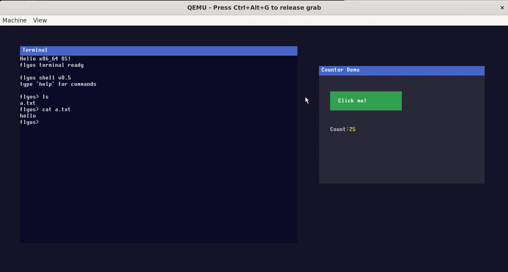

# flyos

一个从零开始编写的 x86_64 操作系统。UEFI 引导，包含完整的内存管理、多任务、用户态、文件系统、持久化和图形界面。



## 功能

- **引导**：UEFI + GRUB2 (Multiboot2) + 64 位长模式
- **中断**：IDT 256 门、CPU 异常、panic + 栈回溯
- **硬件驱动**：8259A PIC、8253 PIT (100Hz)、PS/2 键盘、PS/2 鼠标、ATA PIO、VESA/UEFI framebuffer
- **内存**：物理内存 bitmap 分配器、4 级页表虚拟内存、内核堆 kmalloc/kfree
- **进程**：抢占式轮转调度、阻塞 / 等待队列 / sleep
- **用户态**：ring3、`syscall`/`sysret`、ELF64 加载、简易 libc
- **文件系统**：ramfs、ATA 磁盘持久化、VFS 层
- **图形**：1280×800 framebuffer、8×16 像素字体、图形化鼠标光标、窗口系统、按钮事件、终端窗口

## 截图

系统启动后显示两个窗口：左边是运行在 ring3 的 shell，右边是按钮计数器 demo。

## 编译运行

### 环境要求

- Linux 或 WSL2（Ubuntu 22.04+）
- `gcc`、`ld`、`make`、`nasm`、`xorriso`、`grub-pc-bin`、`grub-common`、`qemu-system-x86`、`ovmf`

安装：

```bash
sudo apt install build-essential nasm qemu-system-x86 xorriso \
                 grub-pc-bin grub-common grub-efi-amd64-bin mtools ovmf